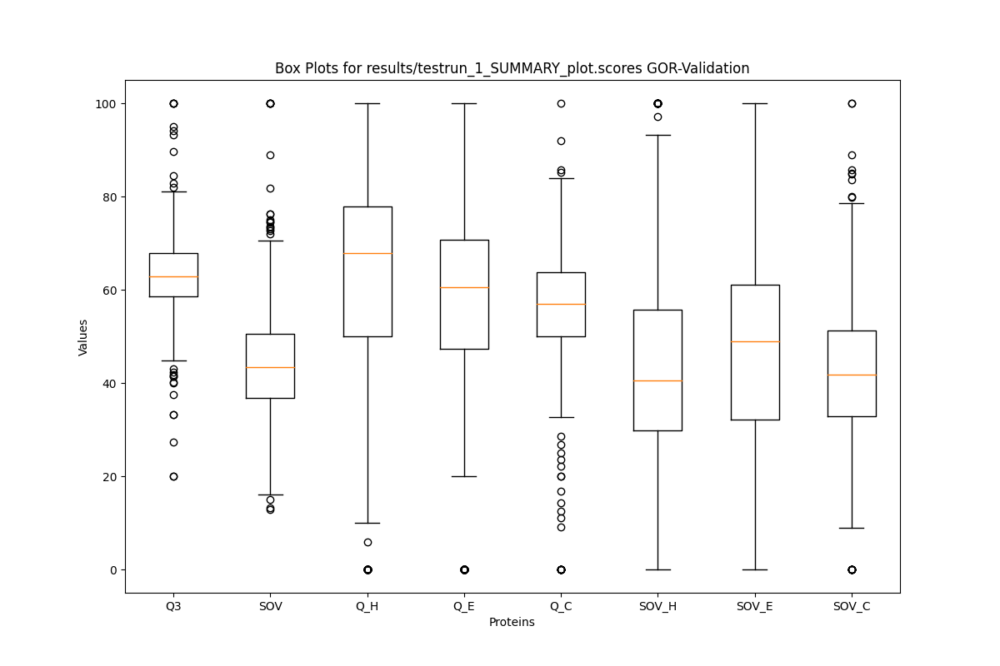

# Protein Secondary Structure Prediction
This repository contains the java source code of a group project,
aiming to implement *Garnier-Osguthorpe-Robson Method* [^Paper]. 



# Usage
> [!NOTE]
> It is recommended to checkout our cross validation repository (https://github.com/github4touchdouble/gor-cross-validation/tree/master) for easier usage.

## (1) train.jar
Train a GOR model (I, III or IV) based on a `.db` input file.
To train GOR (V_I, V_III, V_IV) provide a directory containing multiple secondary structure alignments (see `datasets/AlignmentFiles/CB513MultipleAlignments`).
```bash
java -jar out/artifacts/train.jar 
--db datasets/cb513.db                                   # training sequences
--method gor1                                            # [gor1|gor3|gor4]
--model models/testrun_1.mod                             # output model file
[--maf datasets/AlignmentFiles/CB513MultipleAlignments/] # maf directory
```

## (2) predict.jar
Predict unseen data with your trained GOR model you created above.
Provide a `.fasta` file as input.
```bash
java -jar predict.jar
--model models/testrun_1.mod                                     # loads gor model to predict new seqs
[--seq validation/hobohm97.fasta                                 # input fasta file [GOR_I - IV]
| --maf datasets/AlignmentFiles/CB513MultipleAlignments/]        # input alignment file [GOR_V]
--format txt                                                     # input format [txt|html] html currently not covered
```

## (3) trainPredict.jar
A combination of the jars above **(1)** & **(2)**.
```bash
java -jar out/artifacts/trainPredict.jar
--model  models/testrun_1.mod                       # path to save model (needs to correspond to --modelT)
[--seq validation/hobohm97.fasta | --maf datasets/AlignmentFiles/CB513MultipleAlignments/] # either .fasta or multiple alignments
--format txt                                        # format
--db datasets/cb513.db                                 # train file
--method gor3                                       # gor type [gor1| gor3 |gor4]
--modelT models/testrun_1.mod                       # path t load model (needs to correspond to --model)
--out predictions/testrun_1.prd                     # predictions out
[--w 17]                                            # windowsize (default=17)
```

## evalGor.jar
Jar to validate a predicted `.fasta` file.
```bash
java -jar out/artifacts/evalGor.jar
-p predictions/testrun_1.prd                              # predictions to validate
-r cb513.db                                               # reference .db file corresponding to .fasta file of .prd
-s results/testrun_1_SUMMARY.txt                          # summary file across all seqs containing SOVs and Q3s
-d results/testrun_1_DETAILED.txt                         # scores per residue
-b                                                        # plot results

```


[^Paper]: J. Garnier, D.J. Osguthorpe, B. Robson,
Analysis of the accuracy and implications of simple methods for predicting the secondary structure of globular proteins,
Journal of Molecular Biology,
Volume 120, Issue 1,
1978,
Pages 97-120,
ISSN 0022-2836,
https://doi.org/10.1016/0022-2836(78)90297-8.
(https://www.sciencedirect.com/science/article/pii/0022283678902978)
